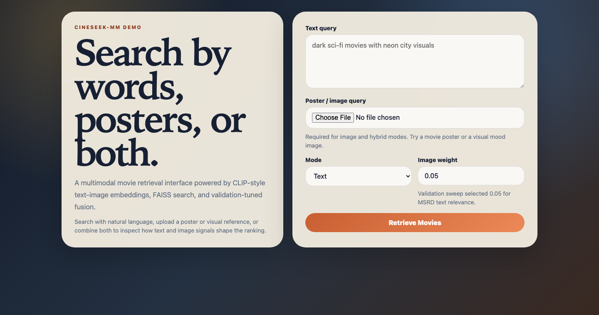
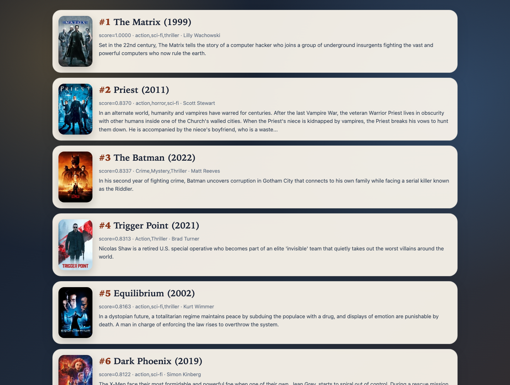

# CineSeek-MM: Multimodal Movie Retrieval

CineSeek-MM extends the original CineSeek movie search project into a multimodal retrieval system. It uses CLIP-style text-image embeddings over movie metadata and posters, supports text, image, and hybrid queries, and evaluates retrieval quality against both text-query relevance labels and image-query tasks.

This repo is intentionally more technical than product-facing. The original CineSeek project is the deployed web demo; CineSeek-MM focuses on multimodal encoding, FAISS indexing, evaluation, and retrieval tradeoffs.

## What This Project Shows

- **Multimodal retrieval**: text, poster image, and text+image query support in a shared embedding space.
- **PyTorch / CLIP pipeline**: batched CLIP text and image encoding with normalized 512-d embeddings.
- **FAISS serving path**: precomputed item embeddings and low-latency nearest-neighbor search.
- **Evaluation discipline**: text-only, hybrid, image-identity, and MSRD-aligned poster-query evaluations.
- **Demo interface**: a FastAPI UI for showcasing and inspecting text/image/hybrid retrieval behavior.

## System Design

```text
Text query  -> CLIP text encoder  \
                                -> shared embedding space -> FAISS -> ranked movies
Image query -> CLIP image encoder /

Movie metadata -> CLIP text encoder  \
                                      -> hybrid item representation
Movie poster   -> CLIP image encoder /
```

The item collection contains `9,692` movies. Poster coverage is `99.4%`, and both metadata and poster embeddings are stored as `9692 x 512` matrices.

## Methods

- CLIP model: `openai/clip-vit-base-patch32`
- Text encoder: CLIP text tower over movie metadata and user text queries
- Image encoder: CLIP vision tower over movie posters and uploaded image queries
- Index: `FAISS IndexFlatIP` over L2-normalized embeddings
- Hybrid item representation: weighted fusion of metadata and poster vectors
- Tuned hybrid weight: `image_weight=0.05`, selected on validation recall@10
- Evaluation metrics: recall@k, MRR, NDCG, average encode latency, average search latency

## Main Results

### Text-query retrieval on the original CineSeek split

This evaluates natural-language text queries against the same MSRD validation/test split used by the original CineSeek project.

| Model | Split | recall@10 | recall@50 | recall@100 | MRR | NDCG | encode ms | search ms |
| --- | --- | ---: | ---: | ---: | ---: | ---: | ---: | ---: |
| original CineSeek sentence-transformer | val | 0.944 | 0.970 | 0.976 | 0.828 | 0.862 | 0.67 | 0.044 |
| original CineSeek sentence-transformer | test | 0.931 | 0.963 | 0.973 | 0.829 | 0.862 | 0.61 | 0.042 |
| frozen CLIP text | val | 0.820 | 0.864 | 0.884 | 0.736 | 0.767 | 2.23 | 0.033 |
| frozen CLIP text | test | 0.840 | 0.881 | 0.897 | 0.747 | 0.780 | 1.90 | 0.031 |
| frozen CLIP hybrid, tuned `image_weight=0.05` | val | 0.821 | 0.867 | 0.883 | 0.736 | 0.768 | cached | 0.028 |
| frozen CLIP hybrid, tuned `image_weight=0.05` | test | 0.841 | 0.882 | 0.897 | 0.746 | 0.779 | cached | 0.028 |

Takeaway: the current original CineSeek sentence-transformer baseline remains strongest for text-only semantic movie search. Frozen CLIP is still useful in this repo because it provides a shared text-image space for poster and hybrid retrieval, but it is not a replacement for the strongest text-only baseline. Poster fusion gives a tiny recall@10 lift over CLIP text when tuned on validation, but does not materially improve MRR/NDCG for text-only MSRD queries.

### Fusion weight sweep

The validation sweep selected `image_weight=0.05`.

| image_weight | val recall@10 | val MRR | val NDCG |
| ---: | ---: | ---: | ---: |
| 0.00 | 0.820 | 0.736 | 0.767 |
| 0.05 | 0.821 | 0.736 | 0.768 |
| 0.10 | 0.821 | 0.735 | 0.767 |
| 0.35 | 0.806 | 0.702 | 0.741 |
| 0.50 | 0.629 | 0.309 | 0.427 |
| 1.00 | 0.002 | 0.001 | 0.004 |

Takeaway: a large poster weight hurts text-query ranking because the MSRD labels are primarily semantic/relevance labels, not visual-style labels.

### Image-query poster retrieval

This task uses an augmented poster image as input and retrieves the same movie identity from the poster index.

| Input variant | Label | recall@1 | recall@5 | recall@10 | MRR | NDCG | encode ms | search ms |
| --- | --- | ---: | ---: | ---: | ---: | ---: | ---: | ---: |
| center crop | same movie id | 0.944 | 0.980 | 0.985 | 0.959 | 0.965 | 9.15 | 0.018 |
| color jitter | same movie id | 1.000 | 1.000 | 1.000 | 1.000 | 1.000 | 8.74 | 0.013 |
| blur | same movie id | 0.976 | 0.993 | 0.997 | 0.984 | 0.987 | 8.49 | 0.012 |
| thumbnail crop | same movie id | 0.780 | 0.878 | 0.908 | 0.821 | 0.842 | 8.70 | 0.011 |

Takeaway: CLIP poster embeddings are robust for visual identity and near-duplicate poster retrieval, especially under mild transformations.

### MSRD-aligned image-only recommendation

This stricter task uses one relevant movie poster as the input and treats the other movies in the same MSRD positive set as labels. The input poster movie itself is excluded from labels.

| Split | Label setting | recall@10 | recall@50 | recall@100 | MRR | NDCG | encode ms | search ms |
| --- | --- | ---: | ---: | ---: | ---: | ---: | ---: | ---: |
| val | leave-one-positive-out | 0.558 | 0.689 | 0.765 | 0.233 | 0.350 | 8.57 | 0.026 |
| test | leave-one-positive-out | 0.580 | 0.699 | 0.771 | 0.245 | 0.362 | 8.39 | 0.034 |

Takeaway: poster-only input can recover related movies from the same relevance set, but ranking is much weaker than text-query retrieval. This is expected: one poster captures visual/aesthetic similarity, not necessarily the full semantic intent behind the original text query.

## Key Findings

- The current raw sentence-transformer CineSeek baseline remains the strongest choice for text-only movie search.
- Frozen CLIP is valuable because it enables image and hybrid retrieval in a shared text-image embedding space.
- Poster embeddings are valuable for image-query and visual-similarity retrieval.
- Poster fusion should be tuned conservatively for text-query search; a large image weight degrades ranking.
- Text metadata remains the dominant signal for plot-, actor-, and intent-heavy movie search.
- Precomputed embeddings plus FAISS keep online search latency low; the slower step is online image encoding.

## Repository Layout

```text
cineseek-multimodal/
├── README.md
├── requirements.txt
├── apps/demo/                  # FastAPI demo interface
├── data/
│   ├── processed/              # movie/query tables and embeddings
│   └── posters/                # downloaded poster subset/full set
├── artifacts/indexes/          # FAISS indexes
├── experiments/                # saved metrics and experiment notes
├── scripts/run_all.sh
└── src/
    ├── prepare_data.py
    ├── encode_text.py
    ├── encode_image.py
    ├── build_index.py
    ├── retrieve.py
    ├── evaluate_original_split.py
    ├── sweep_fusion.py
    ├── evaluate_image_query.py
    ├── evaluate_image_msrd.py
    └── cineseek_mm/
```

## Quick Start

```bash
python3 -m venv .venv
source .venv/bin/activate
pip install -r requirements.txt
```

Prepare data and posters:

```bash
PYTHONPATH=src python src/prepare_data.py --max-items 2000
```

For the full reported experiments, use the full `9,692` item set rather than the fast 2,000-item subset:

```bash
PYTHONPATH=src python src/prepare_data.py --max-items 9692
```

Encode metadata and posters:

```bash
PYTHONPATH=src python src/encode_text.py
PYTHONPATH=src python src/encode_image.py
```

Build indexes:

```bash
PYTHONPATH=src python src/build_index.py --mode all --image-weight 0.05
```

Run retrieval:

```bash
PYTHONPATH=src python src/retrieve.py --text "dark sci-fi movies with neon city visuals" --mode text
PYTHONPATH=src python src/retrieve.py --image data/posters/436270.jpg --mode image
PYTHONPATH=src python src/retrieve.py --text "psychological horror" --image data/posters/882598.jpg --mode hybrid --image-weight 0.05
```

## Reproducing Evaluations

Evaluate text and hybrid retrieval on the original CineSeek split:

```bash
PYTHONPATH=src python src/evaluate_original_split.py --mode text --split val
PYTHONPATH=src python src/evaluate_original_split.py --mode text --split test
PYTHONPATH=src python src/sweep_fusion.py --save-best-hybrid
```

Evaluate image-query behavior:

```bash
PYTHONPATH=src python src/evaluate_image_query.py
PYTHONPATH=src python src/evaluate_image_msrd.py --split val --input-policy first
PYTHONPATH=src python src/evaluate_image_msrd.py --split test --input-policy first
```

Saved outputs live in `experiments/`:

- `phase1_results.json`
- `fusion_sweep_results.json`
- `image_query_results.json`
- `image_msrd_val_first.json`
- `image_msrd_test_first.json`

## Demo Interface

CineSeek-MM includes a FastAPI demo for showcasing and inspecting text, image, and hybrid retrieval. It supports natural-language queries, poster/image uploads, and validation-tuned fusion.





```bash
source .venv/bin/activate
PYTHONPATH=src KMP_DUPLICATE_LIB_OK=TRUE OMP_NUM_THREADS=1 \
  uvicorn apps.demo.app:app --host 127.0.0.1 --port 8010 --reload
```

Open:

```text
http://127.0.0.1:8010
```

Supported modes:

- `Text`: text query -> metadata/text index
- `Image`: uploaded poster/image -> poster image index
- `Hybrid`: text query + uploaded image -> fused query embedding

The default demo image weight is `0.05`, matching the validation sweep.

## Resume Framing

**CineSeek-MM: Multimodal Movie Retrieval System**

- Built a CLIP-based multimodal retrieval pipeline over `9.7K` movie posters and metadata, supporting text, image, and hybrid query search with FAISS indexing.
- Evaluated text-only, hybrid, poster-identity, and MSRD-aligned image-query retrieval with recall@k, MRR, NDCG, and latency metrics.
- Found that poster embeddings are strong for visual retrieval but should be used as a weak auxiliary signal for text-query recommendation, improving recall only when carefully tuned.

## Next Phase

The next useful extension is lightweight adaptation, not full model retraining:

- Train a small projection head over frozen CLIP embeddings with MSRD relevance labels.
- Add hard-negative mining from FAISS top-k false positives.
- Compare frozen CLIP vs adapted projection head on recall@k, MRR/NDCG, and latency.
